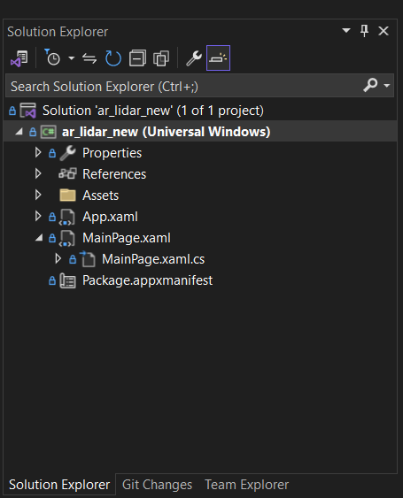
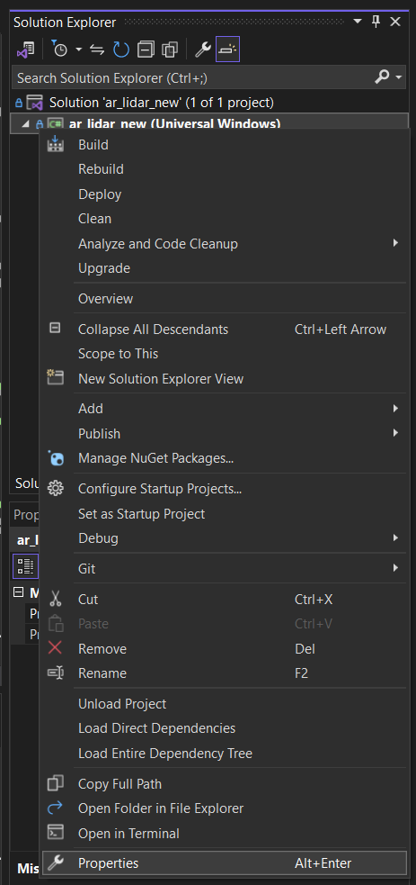
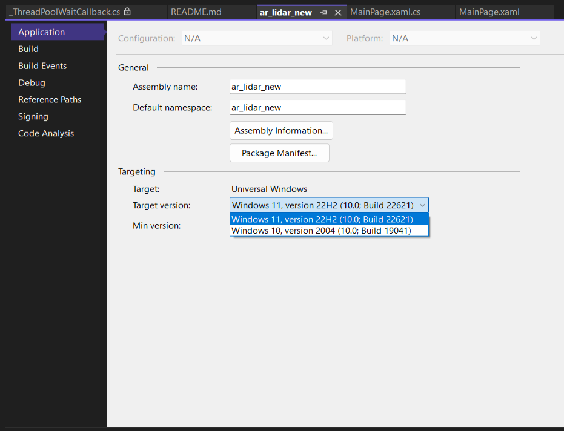
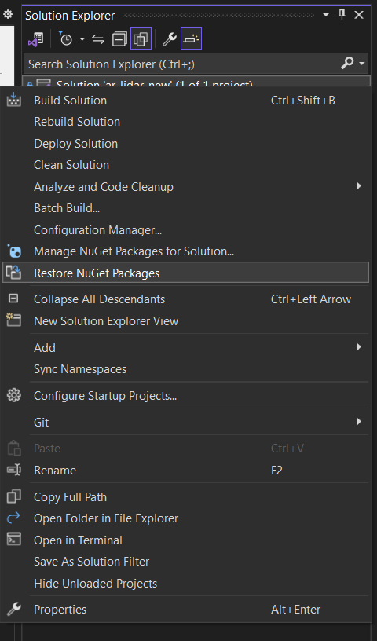
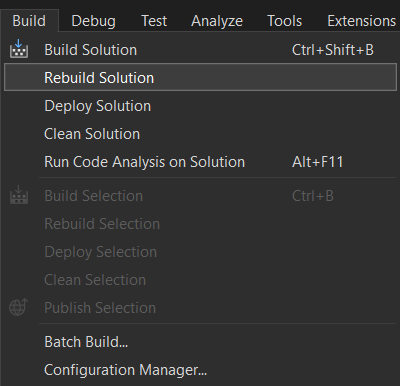

# Facial Recognition Program 

## Introduction 
- This project is part of the senior design project:

>**Facial Recognition and Detection using Augmented Reality Headset with Cloud Server and SmartMesh IP Network**

- Advisor: Dr Zheng 

- Commitee: Dr Hossain, Dr Cavalcanti
  
- Group members: Brycen Hillukka, Yu Sheng Chan, Hayden Scott, Brandon Wieberdink 

> This project is sponsored by a grant from the Emerson corporation.

- A senior design capstone project. The group members divided the work as follows:
>- Brycen developed all the facial recognition cloud server programs and helped Yu Sheng develop the initial version of both of his systems.
>- Yu Sheng developed the Arduino measuring system as well as the program for the Augmented Reality (AR) headset.
>- Hayden developed/modified the Wireless Sensor Network with the custom network manager.
>- Brandon is in charge of developing the curved LiDAR PCB and upgrading the Wireless Sensor Network PCB.

- The program runs on Microsoft Hololens 2 headset, with features of performing facial recognition when connected to the headset or face detection when running it offline. Besides that, the program also calculates the estimated altitude, latitude, and longitude of the pointed distance with the Arduino based measuring system.

## Requirements 
-   [Microsoft Visual Studio 2022](https://visualstudio.microsoft.com/downloads/), with Universal Windows Platform Development and .NET desktop development installed. 

-   [Windows 10 / 11 SDK](https://developer.microsoft.com/en-us/windows/downloads/windows-sdk/), depending on the Windows Operating System you have. 

-   Bluetooth connection enabled for communication between the LiDAR measuring system and PC / headset.
> The measuring system information can be found [here](https://github.com/YSChan15/Arduino-Measuring-System).

-   A stable internet connection to communicate with the server.
>**Note**: When running offline, the program will only be able to do face detection, not **face recognition**. 


## Running the program 
-   Depending on which version of Windows you are using, you will need to change the target version to run the program. 

> 1. Navigate to Solution Explorer.

 
> 2. Under Solution Explorer, right click on the program with (**Universal Windows**) inside the name. (**NOT THE SOLUTION**).


> 3. Go to Properties. 
> 4. Click on Application. 
> 5. Under Targetting, choose the target version based on your operating system. Do not pick anything under the minimum requirements or above your operating system. 



> **NOTE**: If you did not change the target version based on your operating system, your system will not be able to display the design under MainPage.xaml.  

-   Right click on Solution. Then, click "Restore NuGet Packages". 



-   On the tab above, go to Build -> Rebuild solution to make sure that there's no error. 



> If the warning sign is about async method lacks "await" operators, the warning sign can be safely ignored. Else, please run the debugging process.  

### Bluetooth connection 
-   The measuring system uses BLE module to connect to the headset. If you wish to use Non-BLE device, please edit to your needs. 

-   The BLE device's characteristics and services can be found using BLE scanner with your phone / PC. You can use any application that provides the characteristics and services of the BLE device. 

-   The program to search for the BLE characteristics and services can be found [here](https://play.google.com/store/apps/details?id=com.macdom.ble.blescanner&hl=en) (Android Phone).

-   Once you found the characteristics / services, use the found ID to replace the ID under **public MainPage()** under MainPage.xaml.cs for both MyService_GUID and MyCharacteristic_GUID.


### When running on PC 
>   **NOTE: This step needs to be run everytime there is a change to make sure that the program running on the PC is up to date.** 

>   **If no changes are made to the program, user can just go into Start -> Other Programs and look for the UWP program that has been installed inside the PC. This will save a lot of time and resources.**

1)   Select Debug Mode as solution configuration. 


2)   Select x86 as the platform.


3)   Select Local Machine as the target. 


4)   Click "Local Machine" to run the program. 

5)  The permission will run on the PC and goes into Debug Mode. On the PC, the user needs to grant the permission to use the camera and the microphone.
>**NOTE**: This step is not always required. Granting permission is usually done during the first run or when the program undergoes a major changes. If there is no pop up permission, user can safely ignore step 5 above.

### When running on Hololens 2
>   **NOTE: This step needs to be run everytime there is a change to make sure that the program running on the headset is up to date.** 

>   **If no changes are made to the program, user can just go into Start -> Other Programs and look for the UWP program that has been installed inside the headset. This will save a lot of time and resources.**

1)  Select Debug Mode as solution configuration. 


2)   Select ARM as the platform. 


>   Try ARM64 as the platform instead if program could not run. 


3)   Select Remote Machine as the target. 


4)   Go to ***program name*** Debug Properties.


5)  Type in the Address of the Hololens 2. If connected to the school WiFi, use the following address: 
```
10.101.18.5 
```
and set Authentication Mode to Universal (Unencrypted Protocol). 


>   **NOTE**: If you are using HoloLens 2 on a different network other than HuskeyNet Secure or Visual Studio could not find the address, the address might have changed. In HoloLens 2, go to Settings -> Update & Security -> For developers. Under the “Device Portal” section, IP address of the Device can be found on the Connect using Wi-Fi section. The address is number after the https://. Replace the address with the number. 

> **NOTE**: If this is the first time the PC is being paired with the Hololens 2, additional pin is required.
The additional pin can be found under Settings -> Update & Security -> For developers -> Pair. 

6) The button besides the platform selection should be changed from Local Machine to Remote Machine. Click "Remote Machine" to run the program. 

>   This will take a while to upload it to the headset. It should take around 10-60 seconds, depending on the network connection / PC hosting the program. 

7)  The program will run on the headset once the PC goes into Debug Mode. On the headset, the user needs to grant the permission to use the camera and the microphone.
>**NOTE**: This step is not always required. Granting permission is usually done during the first run or when the program undergoes a major changes. If there is no pop up permission, user can safely ignore step 7 above.


## Program Features 
Once program is launched, the program has 3 main parts.

On the left, user can find the following buttons from top to bottom: 
1) Face detection button. This will draw a box around each face that the program detects. 
2) Take photo button. This will allow the program to take a photo. When photo is taken, the button is temporarily disabled to avoid user from spamming the button. 
> If the program is connected to the server, the headset will transmit the cropped faces to the server for facial recognition. 
3) Connect to server / Disconnect from server button. The purpose of the button is to allow user to connect to the server for face recognition, or disconnect it for no face recognition. 
> Only one of the connect / disconnect button will appear at a time. This is to prevent user from accidentally pressing both buttons at a time, crashing the program / server. 

On the right, user can find multiple textboxes with their description on top of the textbox. The textbox purpose is to display all the measurements data. The column to the far right is the self point data (measurement system on the headset). The column on the second right displays the measured / estimated point data with the measurement data from the measurement system. 

On the center is the camera view from the headset. The camera preview is overlayed on top of the boxes / buttons.

### Taking measurements with the measurement system. 
-   The measurement system is an Arduino based system. The purpose of the system is to just collect data and send the data to the program for calculation. Therefore, only a simple microcontroller is needed to run the task.

-   Refer to arduino-code under the github branch for more information about the measurement system.

### Setting up the cloud server
-  Ensure that all the cloud programs are installed to a directory on the server. In each of the programs, modify the IP Address and Ports to your needs. Modify the path to the database and database file also.

-  Ensure that a database directory is located inside of this directory. Each image in this file must be a cropped face named by the person and the number of the image (i.e. the 19th image of Brycen is Brycen19.jpg).

-  Create a database text file named "Database.txt" to be used by the cloud programs. This file must contain the complete paths to each file in the database along with the label associated with them. In this project, Brycen is 0, Yu Sheng is 1, Brandon is 2, and Hayden is 3. An example line in the file is "<path_to_file>/Brycen19.jpg;0".

-  To compile all the programs, run the "make" command.

-  To run the Support Vector Machine facial recognition cloud server program, run "./CPSVM".

-  To run the Local Binary Patterns Histograms facial recognition cloud server program, run "./CPLBPH".

-  To run the Eigenface facial recognition cloud server program, run "./CPEF".

-  To run the Fisherface facial recognition cloud server program, run "./CPFF".

-  Ensure that this program is running on the cloud server before running the program on the AR headset and the Wireless Sensor Network.

### Connecting to the cloud server from the AR headset
-  Amazon EC2 cloud based server is used to process the face recognition. Change the IP Address and Port according to your needs.

-  To connect to the server, just press the button "Connect to Server" and it will automatically connect.

>  If it connects successfully, the button will disappear and it will stay connected to the server until the program is closed / terminated. 

> With new updates, the program can now disconnect from the server instead. The "Disconnect From Server" button will appear once the connection is made, allowing user to have the option to terminate their connection with the server from their side. 

-  Once connected to the server, everytime a picture is taken, the program will transmit the most current picture taken and send it to the server, if there's faces to be recognized. 

### Detecting / Recognizing face 
-   The detecting / recognizing face algorithm has two seperate parts. The detecting part is run purely from the program, which requires no additional server connection to do so. 

-   To recognize faces, the face has to be part of the database on the server. Then, whenever a picture is taken with faces inside the frame of the picture, it will be transmitted to the server for analysis. The server will send back names and it will be displayed on the box where the face is drawn.

> The faces are compared against the database on a server. If the faces are not part of the database, it will display unknown on the non-recognized face.

> This program is intended and able to perform multiple face recognition at a time. However, the orientation when taking the picture needs to be fixed. Any changes on the orientation will result in inaccuracy of the data as the facial algorithm only allows 1 face to be compared to the database at a time. 


